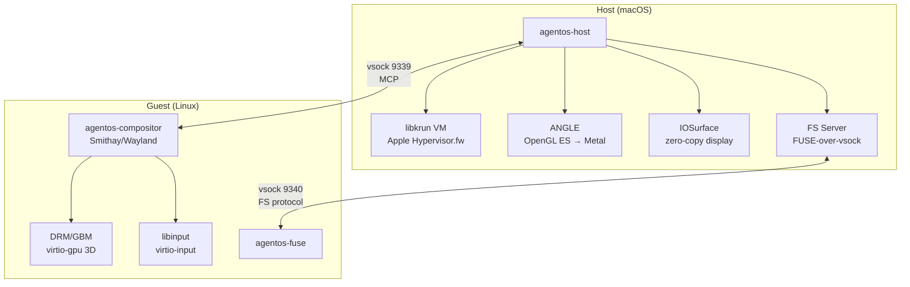

# AgentOS

Lightweight VM for AI agents

AgentOS runs a full Linux desktop inside a [libkrun](https://github.com/containers/libkrun) microVM with GPU acceleration, then exposes it to agents via [MCP](https://modelcontextprotocol.io) tools — screen capture, mouse, keyboard, window management, shell, and file I/O.

## Architecture



## Crates

| Crate | Description |
|---|---|
| `agentos-host` | macOS host — VM lifecycle, display, input forwarding |
| `agentos-compositor` | Linux guest — Wayland compositor with DRM backend |
| `agentos-fuse` | Linux guest — FUSE daemon for host filesystem mounting |
| `agentos-protocol` | Shared MCP tool definitions, JSON-RPC types, FS wire protocol |

## MCP Tools

| Tool | Description |
|---|---|
| `screen_capture` | Capture the guest display (full or region) |
| `mouse_move` | Move cursor to absolute position |
| `mouse_click` | Click a mouse button |
| `keyboard_type` | Type a string |
| `keyboard_key` | Press a key with optional modifiers |
| `window_list` | List open windows |
| `window_focus` | Focus a window by ID |
| `window_resize` | Resize a window |
| `window_move` | Move a window |
| `window_open` | Launch a program |
| `window_close` | Close a window |
| `shell_exec` | Run a shell command |
| `file_read` | Read a file |
| `file_write` | Write a file |
| `fs_mount` | Mount a host directory into the guest via FUSE-over-vsock |
| `fs_unmount` | Unmount a FUSE-mounted guest directory |

## Prerequisites

- macOS (Apple Silicon)
- Rust toolchain
- Docker (for guest image and guest binary builds)
- Ninja, Meson, Python 3 (for native dependencies)

## Build

```bash
# 1. Build native dependencies (ANGLE, libepoxy, virglrenderer, libkrunfw, libkrun)
./deps/build-deps.sh

# 2. Build guest compositor (cross-compiled in Docker for aarch64-linux)
./guest/build-compositor.sh

# 3. Build guest FUSE daemon (cross-compiled in Docker for aarch64-linux)
./guest/build-fuse.sh

# 4. Build Debian guest disk image (minimal glibc rootfs + compositor + FUSE binary)
./guest/build.sh

# 5. Build host binary
cargo build --release -p agentos-host

# 6. Codesign (REQUIRED — cargo build strips the hypervisor entitlement every time)
codesign --entitlements agentos-host/entitlements.plist --force -s - target/release/agentos-host

# 7. Run
target/release/agentos-host \
  --kernel guest/out/aarch64/vmlinuz \
  --initrd guest/out/aarch64/initramfs \
  --disk guest/out/aarch64/disk.img
```

## License

[MIT](LICENSE)
