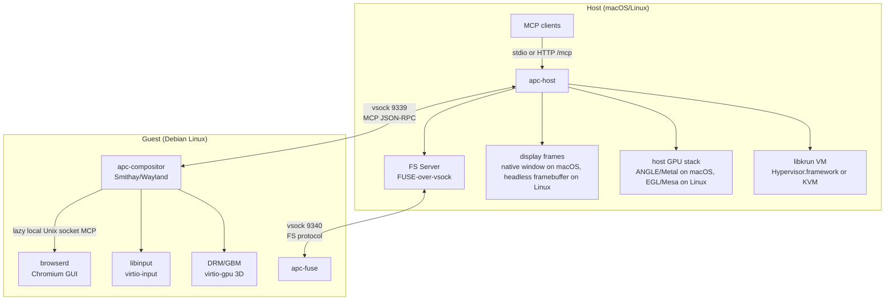

# Agent Personal Computer (APC)

Your AI Agent's personal computer.

APC runs a Debian Linux desktop inside a [libkrun](https://github.com/containers/libkrun) microVM with GPU acceleration, then exposes the desktop and an on-demand Chromium/browserd runtime to agents through [MCP](https://modelcontextprotocol.io). The host supports macOS and Linux. macOS has the native GUI window path; Linux host support is headless/MCP-first.

## Architecture



`apc-host` owns the VM lifecycle, host display/headless framebuffer, input forwarding, and MCP transport endpoints. `apc-compositor` owns the guest desktop and the MCP tool dispatcher. Browser tools are forwarded by the compositor to browserd over a private Unix socket inside the guest.

Browserd is not started at boot. The first `browser_navigate` or `browser_tab_new` call starts `/opt/apc-browserd/browserd` in Chromium GUI mode under `/home/agent`, using Wayland and the guest render node when available. `browser_tab_list` returns `No tabs open` before browserd has been started; other browser tools require an open browser tab.

## Components

| Component | Description |
|---|---|
| `apc-host` | macOS/Linux host binary: VM lifecycle, display or headless framebuffer, input forwarding, MCP stdio and HTTP proxy |
| `apc-compositor` | Linux guest Wayland compositor and MCP dispatcher |
| `apc-fuse` | Linux guest FUSE daemon for host filesystem mounting |
| `apc-protocol` | Shared MCP tool schemas, JSON-RPC types, screenshot helpers, and FS wire protocol |
| `apc-browserd` | Browserd submodule wrapper, build scripts, and packaged Chromium/browserd runtime |

## MCP Transports

APC exposes the same MCP tool set over these host-side transports:

| Transport | How to enable |
|---|---|
| stdio | `--mcp-stdio`; implies `--headless` and proxies JSON-RPC over stdin/stdout |
| Streamable HTTP | `--mcp-http-port <port>` and `--mcp-http-token <token>` or `APC_MCP_HTTP_TOKEN`; listens on `/mcp` |

The HTTP endpoint accepts JSON-RPC objects or batches with `POST /mcp`, requires `Accept: application/json`, and requires `Authorization: Bearer <token>`. Notifications receive `202 Accepted`.

Example:

```bash
target/release/apc-host \
  --kernel guest/out/aarch64/vmlinuz \
  --initrd guest/out/aarch64/initramfs \
  --disk guest/out/aarch64/disk.img \
  --mcp-http-port 9570 \
  --mcp-http-token dev-token
```

## MCP Tools

### Desktop, System, and Files

| Tool | Description |
|---|---|
| `screen_capture` | Capture the real guest display as PNG, full screen or region |
| `mouse_move` | Move the guest cursor to an absolute position |
| `mouse_click` | Click left, right, or middle mouse button |
| `keyboard_type` | Type text into the focused guest surface |
| `keyboard_key` | Press a key with optional modifiers |
| `window_list` | List guest windows with IDs, geometry, focus, and minimized state |
| `window_focus` | Focus and raise a guest window |
| `window_resize` | Resize a guest window |
| `window_move` | Move a guest window |
| `window_open` | Launch a guest program |
| `window_close` | Close a guest window |
| `window_minimize` | Minimize a guest window |
| `shell_exec` | Run a shell command in the guest |
| `file_read` | Read a guest file |
| `file_write` | Write bytes to a guest file |
| `fs_mount` | Mount a host directory into the guest, defaulting to `/home/agent/workspace` |
| `fs_unmount` | Unmount a FUSE-mounted guest path |
| `reboot` | Reboot the APC microVM by restarting the host VM process |

### Browser

Browser tools are backed by browserd/Chromium running inside the guest desktop.

| Tool | Description |
|---|---|
| `browser_navigate` | Navigate the current tab to a URL; cold-starts browserd if needed |
| `browser_navigate_back` | Go back in browser history |
| `browser_navigate_forward` | Go forward in browser history |
| `browser_reload` | Reload the current page |
| `browser_snapshot` | Capture an accessibility snapshot of the current page |
| `browser_take_screenshot` | Take a browser page screenshot |
| `browser_click` | Click an element by accessibility ref |
| `browser_hover` | Hover an element by accessibility ref |
| `browser_type` | Type text into an element by accessibility ref |
| `browser_press_key` | Press a browser key or key combination |
| `browser_select_option` | Select option values in a `select` element |
| `browser_drag` | Drag from one accessibility ref to another |
| `browser_scroll` | Scroll the page |
| `browser_evaluate` | Evaluate JavaScript in the current page |
| `browser_console_messages` | Read page console messages |
| `browser_wait_for` | Wait for selector or text |
| `browser_tab_list` | List browser tabs |
| `browser_tab_new` | Open a new tab; cold-starts browserd if needed |
| `browser_close` | Close a browser tab |
| `browser_resize` | Resize the browser viewport |
| `browser_cookie_list` | List cookies, optionally filtered by URL |
| `browser_cookie_get` | Get a cookie by name |
| `browser_cookie_set` | Set a cookie |
| `browser_cookie_delete` | Delete a cookie by name |
| `browser_cookie_clear` | Clear all cookies |

## Guest Defaults

- User/group: `agent`
- Home: `/home/agent`
- Browser profile: `/home/agent/.config/apc-browserd/profile`
- Browser runtime in guest image: `/opt/apc-browserd`
- Browser IPC socket: `$XDG_RUNTIME_DIR/apc-browserd/browserd.sock`

## Host Support

| Host | Status | Notes |
|---|---|---|
| macOS Apple Silicon | Supported | Native host window, MCP stdio, MCP Streamable HTTP |
| Linux x86_64 | Supported for headless/MCP | Requires KVM and Linux `.so` dependencies; no native host window yet |
| Linux aarch64 | Build path is mostly shared | Not the primary validated Linux target yet |

## Prerequisites

- Rust toolchain
- Docker
- Ninja, Meson, Python 3, and standard native build tools
- macOS: Apple Silicon host
- Linux x86_64: KVM access (`/dev/kvm`) and standard kernel/native build packages

## Build

### macOS Apple Silicon

```bash
# 1. Build native dependencies (ANGLE, libepoxy, virglrenderer, libkrunfw, libkrun)
./deps/build-deps.sh

# 2. Build guest compositor and FUSE daemon in Docker
./guest/build-compositor.sh aarch64
./guest/build-fuse.sh aarch64

# 3. Build and package browserd for the guest image
./apc-browserd/scripts/build.sh aarch64

# 4. Build Debian guest disk image (includes browserd by default)
./guest/build.sh aarch64

# 5. Build host binary
cargo build --release -p apc-host

# 6. Codesign (required because cargo build strips the hypervisor entitlement)
codesign --entitlements apc-host/entitlements.plist --force -s - target/release/apc-host

# 7. Run
target/release/apc-host \
  --kernel guest/out/aarch64/vmlinuz \
  --initrd guest/out/aarch64/initramfs \
  --disk guest/out/aarch64/disk.img
```

### Linux x86_64

Install distro packages for native and kernel builds first. On Debian/Ubuntu:

```bash
sudo apt-get update
sudo apt-get install -y --no-install-recommends \
  build-essential bison bc ca-certificates clang curl flex git \
  libdrm-dev libegl1-mesa-dev libelf-dev libgbm-dev libgles2-mesa-dev \
  libglib2.0-dev libssl-dev meson ninja-build pkg-config python3 python3-pyelftools
```

Then build the Linux host dependencies and x86_64 guest image:

```bash
./deps/build-deps.sh
./guest/build-compositor.sh x86_64
./guest/build-fuse.sh x86_64
./apc-browserd/scripts/build.sh x86_64
./guest/build.sh x86_64
cargo build --release -p apc-host
```

Run Linux hosts in headless/MCP mode:

```bash
APC_MCP_HTTP_TOKEN=dev-token target/release/apc-host \
  --kernel guest/out/x86_64/vmlinux \
  --initrd guest/out/x86_64/initramfs \
  --disk guest/out/x86_64/disk.img \
  --mcp-http-port 9570
```

To package an existing browserd build without recompiling Chromium:

```bash
APC_BROWSERD_SKIP_BUILD=1 ./apc-browserd/scripts/build.sh aarch64
```

To build a guest image without browserd:

```bash
APC_BROWSERD=0 ./guest/build.sh aarch64
```

## License

[MIT](LICENSE)
